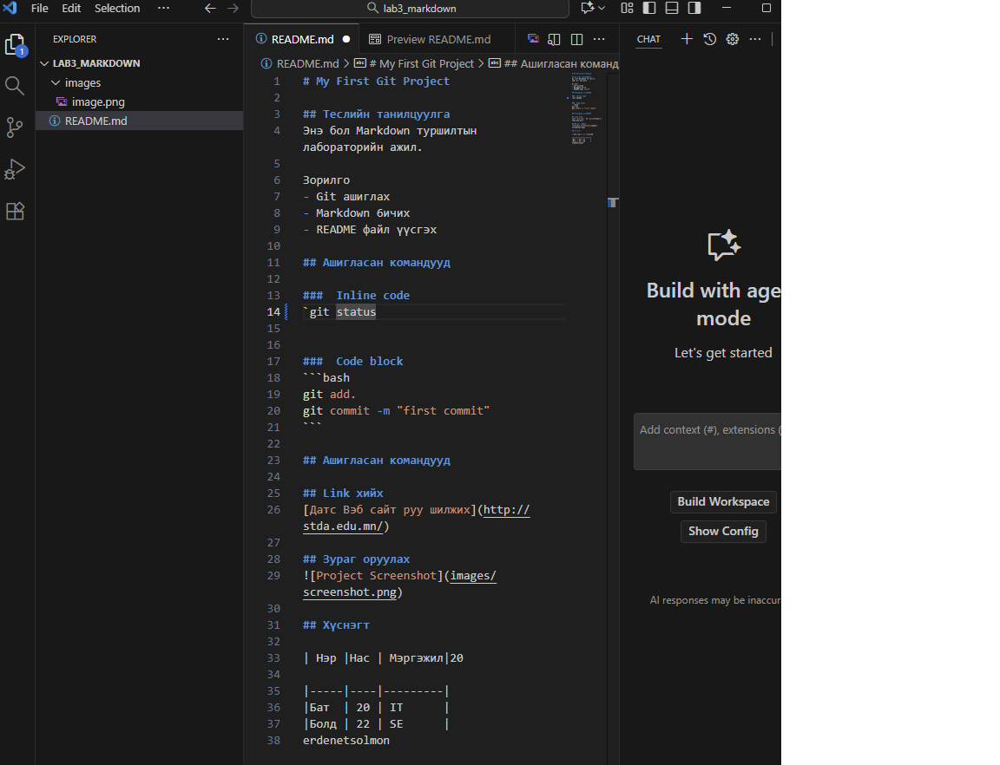

# My First Git Project

## Теслийн танилцуулга
Энэ бол Markdown туршилтын лабораторийн ажил.

Зорилго
- Git ашиглах
- Markdown 6ичих
- README файл үүсгэх

## Ашигласан командууд

###  Inline code
`git status


###  Code block
```bash
git add.
git commit -m "first commit"
```

## Ашигласан командууд

## Link хийх
[Датс Вэб сайт руу шилжих](http://stda.edu.mn/)

## Зураг оруулах


## Хүснэгт

| Hэp |Нас | Мэргэжил|20

|-----|----|---------|
|Бат  | 20 | IT      |
|Болд | 22 | SE      |
erdenetsolmon.